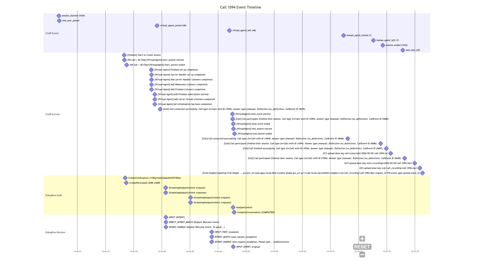

# Call Log Analysis Scripts

This project contains a set of Python scripts designed to fetch, correlate, and visualize call logs from Google Cloud Contact Center AI Platform (CCAIP) and Dialogflow CX.

## Overview

The scripts utilize `gcloud` commands and Google Cloud APIs to gather logs based on Call IDs, map them to Dialogflow Conversation IDs, and generate a timeline visualization of the call events.

## Core Scripts

---

### `get_contact_center_call_logs.py`

*   **Purpose:** Fetches CCAIP logs for a specific call within a given contact center instance. It first searches for logs matching the `call_id` to deduce the `session_id`, and then fetches all logs associated with that `session_id`.
*   **Arguments:**
    *   `--contact_center_project_id` (Required): GCP Project ID where the Contact Center logs reside.
    *   `--contact_center_id` (Required): The ID of the Contact Center instance (e.g., `your-contact-center-id`). This is used to filter `resource.labels.resource_id`.
    *   `--call_id` (Required): The numeric part of the Call ID to trace (e.g., `1106`).
    *   `--lookback` (Optional): Lookback period in minutes. Default: `180`.
    *   `--include_activity` (Optional): Flag to include `contactcenteraiplatform.googleapis.com%2Factivity` logs. Default: False (only includes `...%2Fevents`).
    *   `--save_logs` (Optional): Flag to save the fetched logs to a JSON file named `call_<call_id>_cc_logs.json`. Default: False.
*   **Log Filters:**
    *   `resource.type="contactcenteraiplatform.googleapis.com/ContactCenter"`
    *   `resource.labels.resource_id="<contact_center_id>"`
    *   Variations of `call_id` in `jsonPayload` or `labels.tracker_id`.
    *   `jsonPayload.event.payload.session.id="<session_id>"`

---

### `get_conversation_logs.py`

*   **Purpose:** Fetches Dialogflow CX logs (Audit and Runtime) for a given Dialogflow Conversation ID or a CCAIP Call ID. If a Call ID is provided, it attempts to find the corresponding Conversation ID using utility functions.
*   **Arguments:**
    *   `--virtual_agent_project_id` (Required): GCP Project ID for Dialogflow logs.
    *   `--conversation_id` (Optional): Dialogflow Conversation ID.
    *   `--call_id` (Optional): CCAIP Call ID to map to a Dialogflow Conversation ID.
    *   `--call_id_parameter` (Optional): The session parameter name in Dialogflow logs that holds the Call ID. Default: `call_id`.
    *   `--insights_project_id` (Optional): GCP Project ID for CCAI Insights API, used as a fallback for Call ID to Conversation ID mapping. Defaults to `virtual_agent_project_id`.
    *   `--lookback` (Optional): Lookback period in minutes. Default: `180`.
    *   `--save_logs` (Optional): Flag to save fetched logs to a JSON file. Default: False.
*   **Log Filters:**
    *   **Audit Logs:**
        *   `logName="projects/<va_project_id>/logs/cloudaudit.googleapis.com%2Fdata_access"`
        *   `protoPayload.serviceName="dialogflow.googleapis.com"`
        *   `protoPayload.resourceName` or `protoPayload.response.name` contains `<conversation_id>`
    *   **Runtime Logs:**
        *   `logName="projects/<va_project_id>/logs/dialogflow-runtime.googleapis.com%2Frequests"`
        *   `labels.session_id="<conversation_id>"`

---

### `get_all_call_logs.py`

*   **Purpose:** Orchestrates fetching logs from both CCAIP and Dialogflow for a given Call ID, combines them, and saves them to a file.
*   **Arguments:**
    *   `--contact_center_project_id` (Required): GCP Project ID for Contact Center logs.
    *   `--contact_center_id` (Required): The ID of the Contact Center instance.
    *   `--virtual_agent_project_id` (Optional): GCP Project ID for Dialogflow logs. Defaults to `contact_center_project_id`.
    *   `--call_id` (Required): The numeric part of the Call ID to trace.
    *   `--lookback` (Optional): Lookback period in minutes for log queries. Default: `60`.
    *   `--call_id_parameter` (Optional): Session parameter name for the Call ID in Dialogflow. Default: `call_id`.
    *   `--insights_project_id` (Optional): Project ID for CCAI Insights API. Defaults to `virtual_agent_project_id`.
    *   `--out_file` (Optional): Output file name for the combined JSON logs. Default: `call_<call_id>_all_logs.json`.
    *   `--include_activity` (Optional): Flag to include CCAIP activity logs. Default: False.
*   **Process:**
    1.  Calls `fetch_contact_center_logs` from `get_contact_center_call_logs.py`.
    2.  Calls `fetch_dialogflow_logs` from `get_conversation_logs.py`.
    3.  Combines and sorts the logs by timestamp.
    4.  Saves the result to the specified output file.

---

### `generate_call_timeline.py`

*   **Purpose:** Reads a JSON file containing combined logs (as produced by `get_all_call_logs.py`) and generates a Mermaid Gantt chart in a Markdown file to visualize the call events.
*   **Arguments:**
    *   `--in_file` (Required): Input JSON file with combined logs.
    *   `--call_id` (Required): Call ID for the chart title.
    *   `--out_file` (Optional): Output file name for the Markdown Gantt chart. Default: `call_<call_id>_gantt.md`.
*   **Output:** A Markdown file containing a `mermaid` code block.

---

## Utilities

*   **`script_utils.py`:** Contains helper functions used by the above scripts, including:
    *   `run_gcloud_command()`: Executes gcloud commands.
    *   `get_time_filter()`: Creates timestamp filters for log queries.
    *   `save_json_to_file()`: Saves data to a JSON file.
    *   `get_dialogflow_conversation_id()`: Maps CCAIP Call ID to Dialogflow Conversation ID by checking runtime logs and falling back to the Insights API.

*   **`helpers/find_recent_call_ids.py`:**
    *   **Purpose:** Quickly finds and lists recent Call IDs from CCAIP event logs.
    *   **Arguments:**
        *   `--contact_center_project_id` (Required): GCP Project ID.
        *   `--lookback` (Optional): Lookback period in minutes. Default: `60`.
    *   Displays Call ID, customer domain prefix, and contact center ID.

---

## Typical Workflow

1.  **Fetch all logs for a call:**
    ```bash
    python3 get_all_call_logs.py \
      --contact_center_project_id your-cc-project-id \
      --contact_center_id your-contact-center-id \
      --virtual_agent_project_id your-va-project-id \
      --call_id 1106 \
      --lookback 60 \
      --include_activity
    ```
    This will create a file named `call_1106_all_logs.json`.

    **Example Output of `get_all_call_logs.py` for call_1106:**
    ```text
    --- Fetching Contact Center Logs ---
    --- CC Logs: Pass 1: Querying for Call ID: 1106 to find Session ID ---
    Found 59 logs in Pass 1.
    Deduced Session ID: session_1446
    --- CC Logs: Pass 2: Querying all logs for Session ID: session_1446 ---
    Found 8 logs in Pass 2.
    ...
    --- Fetching Dialogflow Logs ---
    --- Method 1: Trying to find DF Conv ID for Call ID 1106 in logs using parameter 'call_id' ---
    Found Conversation ID via logs: 103sAjHcT7ARAGCyejEjgftCg
    --- DF Logs: Querying Audit Logs for Conversation ID: 103sAjHcT7ARAGCyejEjgftCg in project your-va-project-id ---
    Found 8 audit log entries.
    --- DF Logs: Querying for Runtime Logs for Session ID: 103sAjHcT7ARAGCyejEjgftCg ---
    Found 6 runtime log entries.
    ...
    Successfully saved 75 items to call_1106_all_logs.json

    --- Combined Log Summary ---
    Call ID: 1106
    Total Logs: 75
    Oldest Log: 2026-02-03T10:03:36.601801322Z
    Newest Log: 2026-02-03T10:05:24.760593154Z
    ```

2.  **Generate the timeline chart:**
    ```bash
    python3 generate_call_timeline.py \
      --in_file call_1106_all_logs.json \
      --call_id 1106
    ```
    This will create a file named `call_1106_timeline.md` containing the Mermaid diagram.

    **Example Output of `generate_call_timeline.py`:**
    ```text
    Successfully saved Gantt chart to call_1106_timeline.md
    ```

---

## Timeline Output Example

The generated Markdown file (`call_1106_timeline.md`) will contain a Mermaid code block like this:

```mermaid
// ... Mermaid Gantt chart code generated by the script ...
```

For more information on Mermaid syntax, see [https://mermaid.js.org/](https://mermaid.js.org/).

**Rendered Example:**



